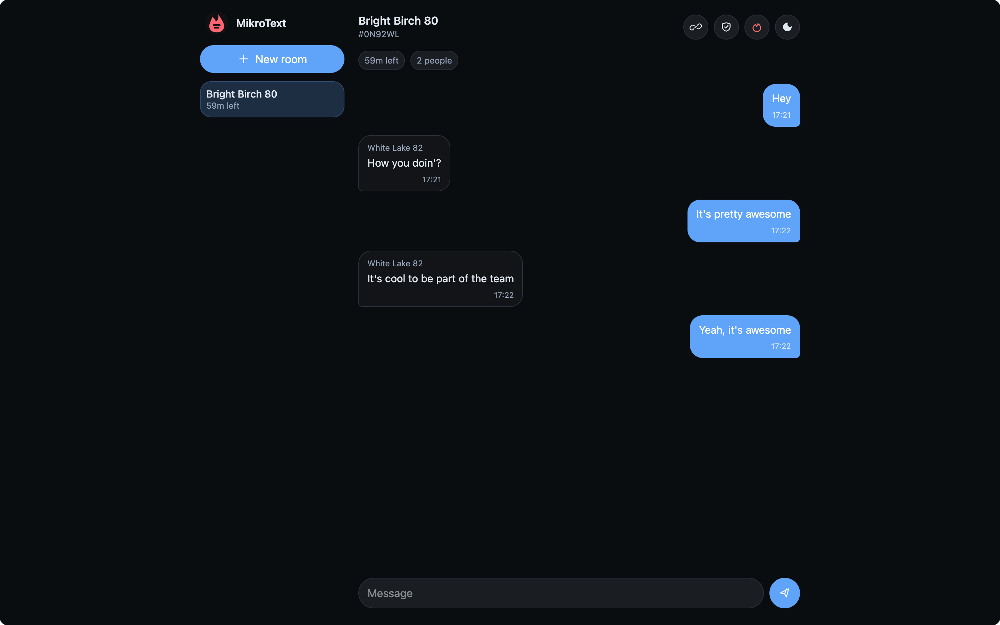

:::tip[Use MikroText Online]
Open [text.mikrosuite.com](https://text.mikrosuite.com) to use the hosted MikroText app.
:::

MikroText is a small private messaging app for short-lived encrypted rooms. It runs as a static browser app with a small relay API, so conversations can stay temporary without accounts, profiles, or long-lived chat history.

Create a room, share a one-time invite, exchange text messages, and let the room expire.

:::note[Security scope]
MikroText keeps message plaintext away from the relay server when the deployed browser app is trusted. It is not a Signal replacement and does not claim Signal-grade forward secrecy.
:::

## What's Included

- **Short-lived rooms**: rooms expire automatically and can be burned manually.
- **No accounts**: participants use random local names for each room session.
- **One-time invites**: invite links are consumed once and carry the room key in the URL fragment.
- **Browser encryption**: message text is encrypted before upload.
- **Signed envelopes**: clients verify signed message envelopes before displaying messages.
- **Safety code**: participants can compare a room code through another channel.
- **Small relay**: the server relays ciphertext and removes room state on expiry, burn, or restart.

## How Rooms Work

The browser creates the room key locally. The key is placed after `#` in the invite URL, which keeps it out of normal HTTP requests to the relay.

The relay sees room IDs, one-time invite tokens, participant pseudonyms, public signing keys, ciphertext envelopes, signatures, timestamps, and expiry data. It does not receive room keys, participant signing private keys, sender chain keys, or plaintext messages.

## Safety code

Each room has a Safety code. Choose Safety code from the room actions and compare it with the person you expect to be in the room through another channel, such as a call or an already trusted chat.

Matching codes mean both browsers see the same room key and the same participant signing keys. If the codes differ, stop using the room and create a new one.

Compare the code again when a new person joins or when the participant count changes unexpectedly.

## Good Fits

MikroText works well for quick private coordination, short-lived support conversations, one-off incident rooms, temporary planning, and other chats where account creation or long history would be more product than the job needs.

Use a persistent team chat or a mature secure messenger instead when you need archives, files, reactions, push notifications, verified long-term identities, or high-assurance secure messaging.

## Get Started

To run MikroText locally from source:

```bash
npm install
npm run dev
```

See [Installation](../getting-started/installation) for release downloads and local serving details.
